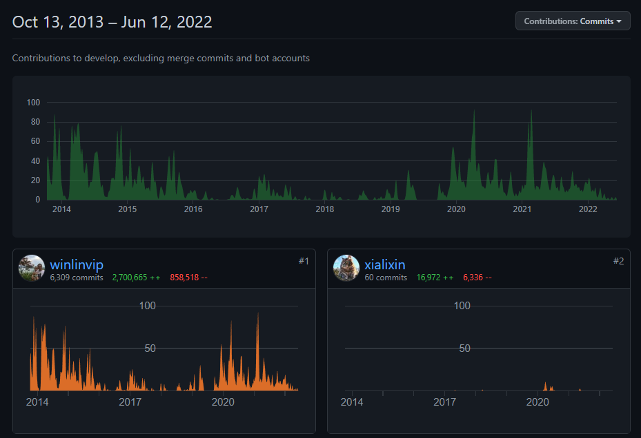
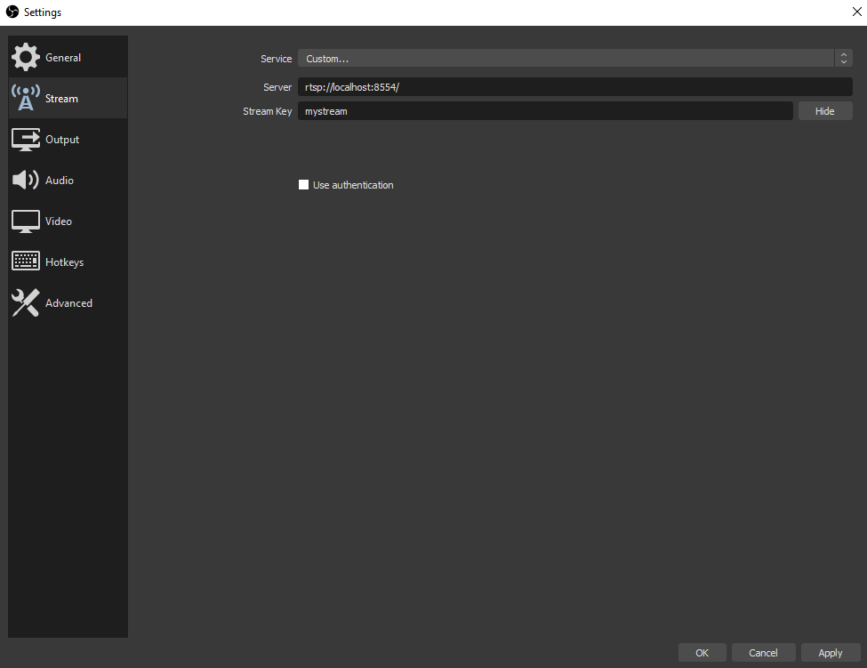
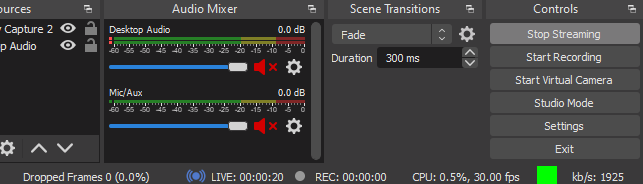
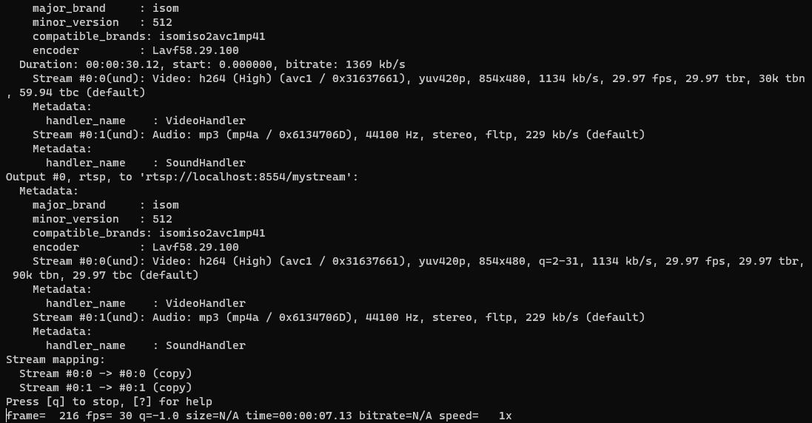

# Simple Streaming Service

TPE para la materia Redes de Información

# RTSP Simple Server

rtsp-simple-server es un servidor listo para su uso y libre de dependencias que permite a los usuarios publicar y reproducir streamings en tiempo real de audio y video a través de múltiples protocolos:

(TODO: Poner links faltantes)
- RTSP
- [RTMP (Real Time Messaging Protocol)](https://en.wikipedia.org/wiki/Real-Time_Messaging_Protocol)
- [HLS](https://en.wikipedia.org/wiki/HTTP_Live_Streaming)

(TODO: Poner foto del cuadro que tienen de los protocolos)

El repositorio se encuentra en [GitHub](https://github.com/aler9/rtsp-simple-server).

(TODO: Completar información de años del proyecto y contribuciones)
El proyecto lleva X años y sigue en mantenimiento.



# Requisitos

## Docker

Para instalar Docker en Ubuntu, seguir la [guía de la documentación oficial](https://docs.docker.com/engine/install/ubuntu/).

# Configuración

(TODO: Cargar configuración)

# Instalación

## Docker

En la carpeta `root`, ejecutar la siguiente línea

```bash
docker run --rm -it -e RTSP_PROTOCOLS=tcp \
-v $PWD/../rtsp-simple-server.yml:/rtsp-simple-server.yml \
-p 8554:8554 -p 1935:1935 -p 8888:8888 \
--name rtsp-server aler9/rtsp-simple-server
```

## Local

Primero descargamos la release oficial del servidor.

```bash
wget https://github.com/aler9/rtsp-simple-server/releases/download/v0.19.1/rtsp-simple-server_v0.19.1_linux_amd64.tar.gz -O rtsp.tar.gz
```

La descomprimimos y accedemos a la carpeta.

```bash
tar xvz rtsp.tar.gz
cd rtsp
```
Luego, iniciamos el servidor.

```bash
./rtsp-simple-server
```bash

## AWS 

El server SRS se puede levantar en una instancia EC2. 
Para intrucciones de configuración ver `aws_condig.md`

# Uso

De ahora en adelante, haremos referencia a la IP del servidor como `$SERVER_IP`.

## Publicar

Para publicar un stream de audio y video, utilizaremos el protocolo RTMP.

### OBS

Desde OBS, en la configuración `Settings`, en la sección de `Stream`, usaremos el Servicio `Custom` con el Servidor `rtmp://$SERVER_IP:1935/app/` y como llave para el stream, la que queramos. En este caso usaremos `mystream`. Es importante recordar la clave ya que se usará luego para acceder al stream.



Luego, podemos iniciar el streaming, y se verá cuando se conectó al servidor en la parte inferior de OBS.



Se puede observar el cuadrado verde y la sección de `LIVE` indicando el tiempo de streaming.

### FFMPEG

Desde la herramienta `ffmpeg`, también podemos streamear. 
Un ejemplo es stremear un video en loop. Para el ejemplo, usaremos un video llamado `demo.flv`.

```bash
ffmpeg -stream_loop -1 -re -i ./demo.flv -c copy -f flv -y rtmp://$SERVER_IP/app/mystream
```

Si funciona correctamente, veremos una salida como la siguiente:



## Reproducir

Para reproducir el streaming, tendremos distintas formas de hacerlo.

### RTMP

Para acceder al streaming, podemos hacerlo mediante el servidor `RTMP`. Un caso de uso es con la herramienta `ffplay`, la cual utiliza las librerías de `ffmpeg`.

```bash
ffplay rtmp://$SERVER_IP/app/mystream
```

Al correr el comando, se reproducirá el stream.


### HLS

Accediendo a `http://$SERVER_IP:8080/app/mystream.m3u8`, obtenemos el archivo `.m3u8`, que nos permite reproducir el streaming. Una forma de probarlo es con la siguiente [App](https://hls-js.netlify.app/demo/). Usando el URL anterior:


### DASH

(TODO: Supuestamente desde la siguiente [App](http://reference.dashif.org/dash.js/nightly/samples/dash-if-reference-player/index.html) podríamos reproducir DASH, pero creo que no lo tengo configurado bien, o no estoy accediendo bien)

### WebRTC

(TODO: Creo que es Peer2Peer, pero tiene un conversor para soportarlo, los puertos están abiertos y todo. Llegué a poder probar el player inclusive - consiguiendo video - desde la WebApp de SRS)

# Grabación de la Sesión 
TODO
srs/trunk/objs/nginx/html/rec/app

# Codecs

Podemos observar los codecs utilizados durante el intercambio del protocolo `RTMP` con la herramienta `Wireshark`.

## Audio HE-AAC

Como codec de Audio se utiliza HE-AAC (High-Efficiency Advanced Audio Coding). Es un formato de compresión de audio digital. Su uso está optimizado para velocidades de transmisión bajas o muy bajas.


## Video H.264

Como codec de Video se utiliza H.264 o MPEG-4 AVC (Advanced Video Coding). Es un formato de codificación de video para grabar y distribuir señales de vídeo.  Suministra imágenes de alta calidad sin consumir demasiado ancho de banda.


# Intercambio de paquetes

En `Wireshark` podemos seguir una trama `RTMP` para observar el intercambio de paquetes entre cliente y servidor.

Se puede ver el Handshake RTMP y la conexión al stream `eugestream`


Se transfiere la información de Audio y Video

