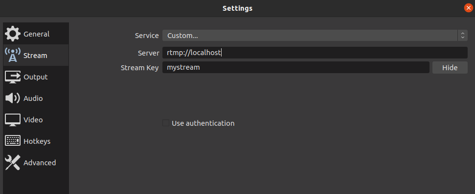

# Simple Streaming Service

TPE para la materia Redes de Información

# RTSP Simple Server

rtsp-simple-server es un servidor listo para su uso y libre de dependencias que permite a los usuarios publicar y reproducir streamings en tiempo real de audio y video a través de múltiples protocolos:

(TODO: Poner links faltantes)
- [RTSP (Real Time Streaming Protocol)](https://github.com/aler9/rtsp-simple-server#rtsp-protocol)
- [RTMP (Real Time Messaging Protocol)](https://github.com/aler9/rtsp-simple-server#rtmp-protocol)
- [HLS](https://github.com/aler9/rtsp-simple-server#hls-protocol)


El repositorio se encuentra en [GitHub](https://github.com/aler9/rtsp-simple-server).

El proyecto lleva 1 año y medio, y sigue en mantenimiento.


# Requisitos

## Docker

Para instalar Docker en Ubuntu, seguir la [guía de la documentación oficial](https://docs.docker.com/engine/install/ubuntu/).

# Configuración

Se utiliza el archivo config.local.yml o config.docker.yml

# Instalación

## Docker

En la carpeta `root`, ejecutar la siguiente línea

```bash
docker run --rm -it -e RTSP_PROTOCOLS=tcp \
-v $PWD/config.docker.yml:/rtsp-simple-server.yml \
-v $PWD/rec/:/rec/ \
-p 8554:8554 -p 1935:1935 -p 8888:8888 \
--name rtsp-server aler9/rtsp-simple-server
```

## Local

Primero descargamos la release oficial del servidor.

```bash
wget https://github.com/aler9/rtsp-simple-server/releases/download/v0.19.1/rtsp-simple-server_v0.19.1_linux_amd64.tar.gz -O rtsp.tar.gz
```

La descomprimimos y reemplazamos el archivo de config.

```bash
tar xvz -f rtsp.tar.gz
rm rtsp.tar.gz
cp config.local.yml rtsp-simple-server.yml
```

Creamos la carpeta para las grabaciones.

```bash
mkdir rec
```

Luego, iniciamos el servidor.

```bash
./rtsp-simple-server
```

## AWS 

El servidor se puede levantar en una instancia EC2. 
Para intrucciones de configuración ver `aws_config.md`

# Uso

De ahora en adelante, haremos referencia a la IP del servidor como `$SERVER_IP`.

## Publicar

Para publicar un stream de audio y video, podremos utilizar el protocolo RTMP o RTSP.

### OBS

En este caso, publicaremos por RTMP.

Desde OBS, en la configuración `Settings`, en la sección de `Stream`, usaremos el Servicio `Custom` con el Servidor `rtmp://$SERVER_IP:1935/` y como llave para el stream, la que queramos. En este caso usaremos `mystream`. Es importante recordar la clave ya que se usará luego para acceder al stream.



Luego, podemos iniciar el streaming, y se verá cuando se conectó al servidor en la parte inferior de OBS.


Se puede observar el cuadrado verde y la sección de `LIVE` indicando el tiempo de streaming.

### FFMPEG

Desde la herramienta `ffmpeg`, también podemos streamear. 
Un ejemplo es stremear un video en loop. Para el ejemplo, usaremos un video llamado `demo.mp4`.

En este caso, podríamos publicar por RTMP, pero vamos a publicar por RTSP.

```bash
ffmpeg -stream_loop -1 -re -i ./demo.mp4 -c copy -f rtsp -y rtsp://$SERVER_IP:8554/mystream
```

Si funciona correctamente, veremos una salida como la siguiente:


En la imagen podemos notar que se estará enviando con codec de video h264 y de audio mp3.

## Reproducir

Para reproducir el streaming, tendremos distintas formas de hacerlo.

### RTMP

Para acceder al streaming, podemos hacerlo mediante `RTMP`. Un caso de uso es con la herramienta `ffplay`, la cual utiliza las librerías de `ffmpeg`.

```bash
ffplay rtmp://$SERVER_IP:1935/mystream
```

### RTSP

También podemos a través de `RTSP`.

Usando `ffplay`:

```bash
ffplay rtsp://$SERVER_IP:8554/mystream
```

Al correr cualquiera de los comandos anteriores, se reproducirá el stream.


O usando `vlc`, por ejemplo.

```bash
vlc rtsp://$SERVER_IP:8554/mystream
```

### HLS

Accediendo a `http://$SERVER_IP:8888/mystream`, obtenemos el archivo `.m3u8`, que nos permite reproducir el streaming. Una forma de probarlo es con la siguiente [App](https://hls-js.netlify.app/demo/). Usando el URL anterior:

Algunos navegadores traen por un reproductor, con lo cual accediendo a la URL anterior, se comienza a reproducir el stream. Firefox es uno de ellos.


# Grabación de la Sesión 

Las grabaciones de las sesiones, se almacenan en la carpeta `rec`, en formato `mp4`.


# Codecs

Podemos observar los codecs utilizados durante el intercambio del protocolo `RTMP` o `RTSP` con la herramienta `Wireshark`.

## Audio

### Audio HE-AAC

Como codec de Audio se utiliza HE-AAC (High-Efficiency Advanced Audio Coding). Es un formato de compresión de audio digital. Su uso está optimizado para velocidades de transmisión bajas o muy bajas.


En este caso fue utilizando `RTMP`.

## Video

### H.264

Como codec de Video se utiliza H.264 o MPEG-4 AVC (Advanced Video Coding). Es un formato de codificación de video para grabar y distribuir señales de vídeo.  Suministra imágenes de alta calidad sin consumir demasiado ancho de banda.


En este caso fue utilizando `RTMP`.

## Comparaciones

### RTMP

#### H.264 y HE-AAC

Por un lado, subiendo un video con codec de video `H.264` y audio `HE-AAC`, tenemos el siguiente ancho de banda.

```bash
ffmpeg -re -i demo.mp4 -c:v libx264 -c:a aac -f flv rtmp://$SERVER_IP:1935/mystream
```


### RTSP

Se puede publicar un video por RTSP 

```bash
ffmpeg -re -i simple-streaming-server/demo.mp4 -c:v libx264 -c:a aac -f rtsp rtsp://$SERVER_IP:8554/mystream 
```

Al capturar los paquetes con Wireshark podemos ver lo siguiente:

#### H.264 y HE-AAC


Ancho de banda


#### H.265 y HE-AAC

```bash
ffmpeg -re -i simple-streaming-server/demo.mp4 -c:v libx265 -c:a aac -f rtsp rtsp://$SERVER_IP:8554/mystream 
```


Ancho de banda


# Intercambio de paquetes


## RTMP

En `Wireshark` podemos seguir una trama `RTMP` para observar el intercambio de paquetes entre cliente y servidor.

Se puede ver el Handshake RTMP y la conexión al stream `mystream`


Se transfiere la información de Audio y Video


## RTSP

En `Wireshark` podemos seguir una trama `RTSP` para observar el intercambio de paquetes entre cliente y servidor.

Se puede ver la conexión RTSP junto con la descripción de la sesión.


Se transfiere la información sobre la sesión para el Audio y Video


Además, se establece el puerto por el cual se va a transmitir la data. Para esto se usa `best-effort`, a través de `UDP`. En este caso vamos a ver donde se transfiere el audio.


Se puede observar el intercambio de información a través de `UDP` en el puerto `12040` en este caso.


Además, podemos observar que aparece [G.711](https://en.wikipedia.org/wiki/G.711), un tipo de codificación muy usada para comprimir y descomprimir señales de audio.

# HTTP API

RTSP Simple Server nos provee una API para configurar el servidor, y poder accionar sobre las conexiones. Podremos observar y cerrar sesiones RTSP, RTMP, así como observar los multiplexadores activos para HLS.

La documentación de la API se puede encontrar [aquí](https://aler9.github.io/rtsp-simple-server/).


Un ejemplo donde obtenemos la cantidad de conexiones abiertas `RTSP` sería el siguiente.

```bash
curl -s http://$SERVER_IP:9997/v1/rtspsessions/list | jq .
```


En este caso, teníamos una única conexión.

# Métricas

También expone un endpoint de métricas, que se pueden acceder de la siguiente manera:

```bash
curl -s http://$SERVER_IP:9998/metrics
```

